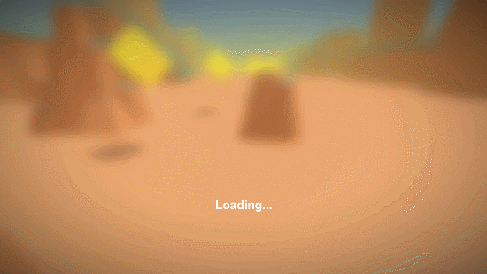
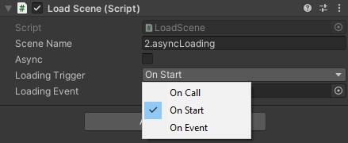

# Easy loading

Set of tools to load scenes and monitor its progress.

## Usage

## Using ScreenTransition

1. Put the LoadScene script in a game object on your first scene.
2. Enter the scene name you want to load.
3. Tick the *async* checkbox if you want an asynchronous loading process
4. Select *OnStart* if you want the load to be launched as soon as the game object is loaded and enabled in your scene.

- Select *OnCall* to disable auto load, and call the public *StartLoading()* method when you want to load the next scene.
- Select *OnTrigger* so the load is done when the specified event is raised in your scene.

## Not using ScreenTransition

1. Put the LoadScene script in a game object on your first scene.
2. Enter the scene name you want to load.
3. Tick the *async* checkbox if you want an asynchronous loading process
4. Select *OnStart* if you want the load to be launched as soon as the game object is loaded and enabled in your scene.

You can select *OnCall* to disable auto load, and call the public *StartLoading()* method when you want to load the next scene.
Or you can select *OnTrigger* so the load is done when the specified event is raised in your scene.

### Demo

See the [FourScenesTemplate project](https://github.com/FredericRP/FourScenesTemplate) for a full demo of this easy loading package.